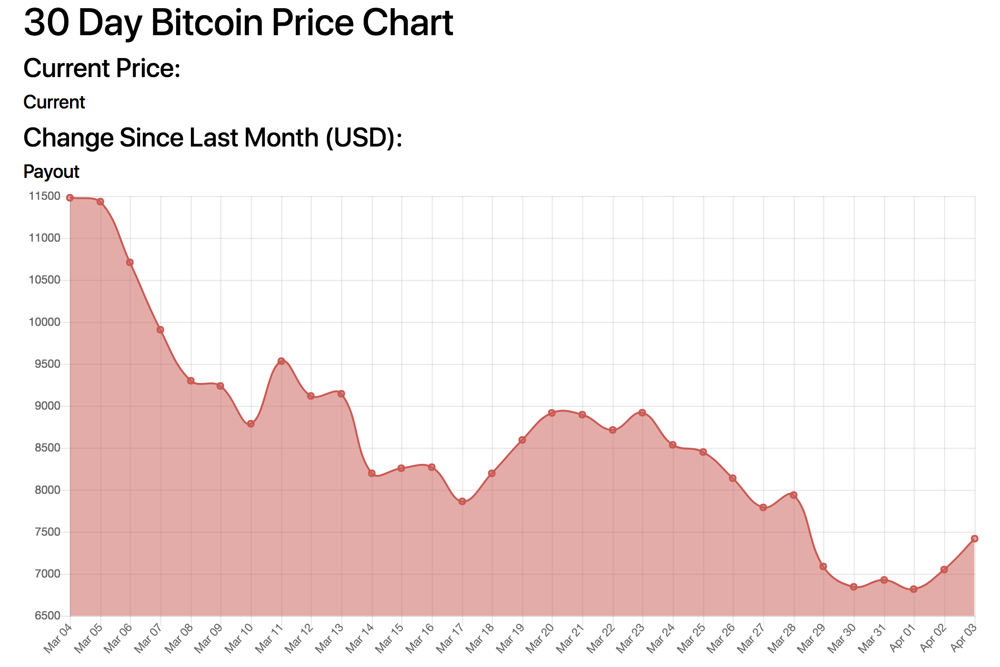
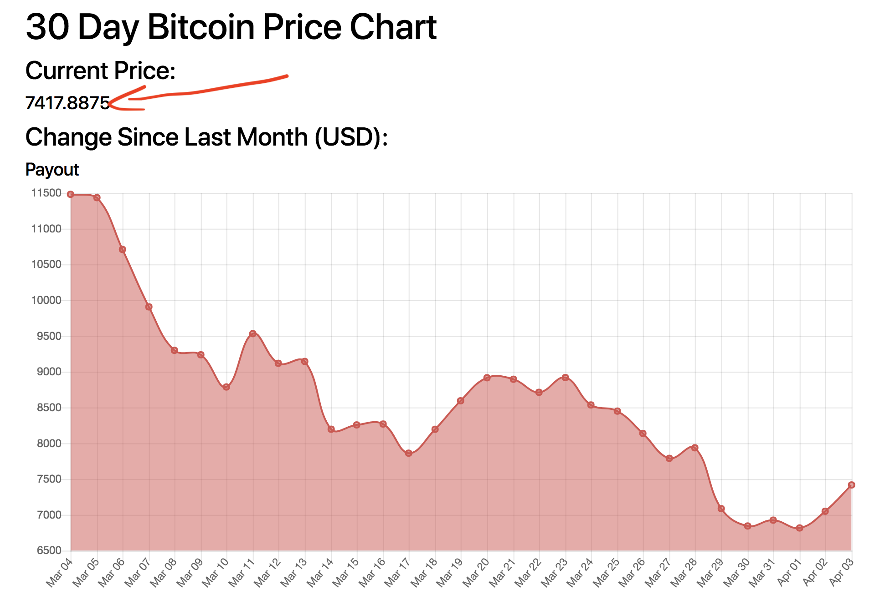
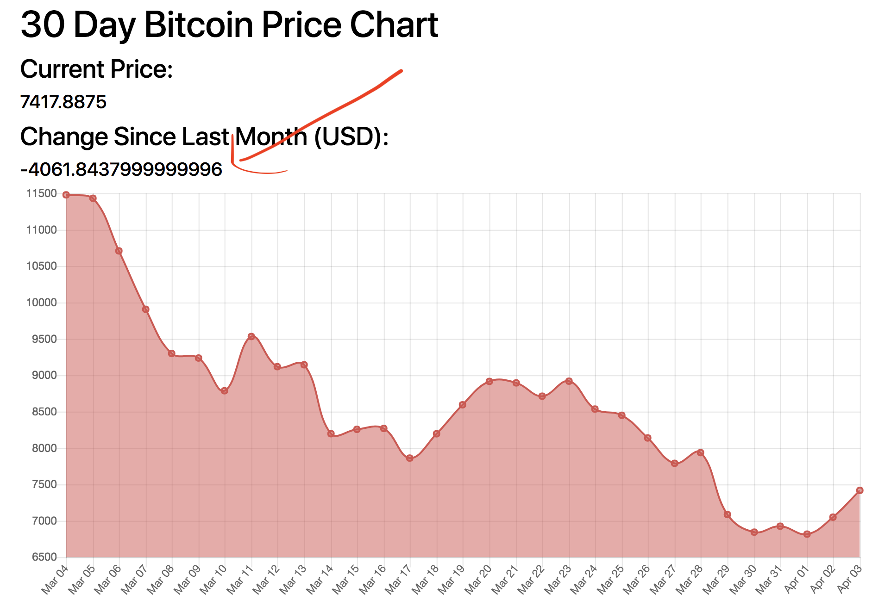

# Bitcoin API Info Box
Now that we have a sweet looking graph, let's add some information on top.<br>

First thing's first, we need to link it properly.  Repeat the same method as you did for `LineChart.js`, importing both React and Component.  And, in `Bitcoin.js`, add the same `data` attribute in your JSX tag for `InfoBox` as you did for `LineChart`.<br>

Now, add this to your `InfoBox.js` file:<br>

```
import React, { Component } from 'react';

export default class InfoBox extends Component {
  constructor(props) {
    super(props);
    this.state ={
      payout: []
    }
  }

  render() {
    return (
      <div>
        <div>
          <div>
            <h3>Current Price:</h3>
          </div>
          <div>
            <h5>Current</h5>
          </div>
        </div>
        <div>
          <div>
            <h3>Change Since Last Month (USD):</h3>
          </div>
          <div>
            <h5>Payout</h5>
          </div>
        </div>
      </div>
    );
  }
};
```

We are repeating similar concepts that we encountered in `LineChart.js`; it is simply not including `dates` (we don't need them here), so we are just going to move on.  You should see something like this:<br>



### Pulling In Data
Now, let's pull in our `componentWillMount()` (very, very similar to what we saw in `LineChart.js`; basically identical, in fact):<br>

```
componentWillMount() {
  const infoData = this.props.data;
  let payout = [];
  for (let thing in infoData) {
    payout.push(infoData[thing])
  }
  this.setState({
    payout: payout
  })
}
```

This is the exact same as what we saw in our `LineChart.js` file, save `dates` is gone; otherwise, it is all the same of what we have seen before.<br>

### Plan of Attack
What are we trying to do here?  The first value we are trying to find is the current price of bitcoin.  This is relatively simple, considering we are working with an array.  The second value we are trying to identify is the difference within the month, effectively finding the value from subtracting the current price from the payout a month ago; again, relatively simple.<br>

To find the first value, we simply pull out the 30th index of our array (being that it is the last value listed and therefore our most-recent).  We already have created an array of the price called `payout`.  And, to access the 30th index of the array, we write `payout[30]`.  But what do we do from there?  Let's use our state.<br>

To begin, add a value in our state up at the top called `infoCurrent` and set it to an empty array, like the others.  In our `setState()`, write this: `infoCurrent: payout[30]`.  And then change your value within your `h5` tag from `current` to `{ this.state.infoCurrent }`.  You should now see this:<br>



Great!  Now let's fix our second value--the change in price over the course of the month.  Again, we already have the value, so we need to subtract the current value of `payout` (`payout[30]`) from the first `payout[0]`.  This will show us the difference over the month.<br>

Again, in our state, let's add another value: `infoPayout` and set it, like all the others, to an empty array.  In our `setState()`, write the following: `infoPayout: payout[30] - payout[0]`.  Then, to see it, replace the value of your `h5` tag from `payout` to `{ this.state.infoPayout }`.  You should now see this:<br>



### Make It Look Nice!
Our values are all here now!  However, it looks ugly again.  So, we should change the values so they make sense.  Let's change our new variables to show currency, rather than just numbers.  In your `setState()`, in your `infoCurrent` value, append `.toLocaleString('us-EN', { style: 'currency', currency: 'USD' })` after your `payout[30]`.  You should now see currency under your Current Price!<br>

But what happens when we append this to the end of the other value?  It throws an `NaN`.  Why?  Because it is converting the numeric value of the `payout[0]` to currency <i>before</i> they are subtracted!  A simple fix to this is to wrap `payout[30] - payout[0]` in parentheses; that should fix the problem.<br>

Great!  You have currency instead of just boring old numbers!  But it still looks pretty bad.  Let's add some syled components to this.  First, import this: `import styled from 'styled-components';`.  Next, right under your imports, add the following:<br>

```
const InfoCard = styled.div `
  display: inline-block;
  width: 50%;
  margin-bottom: 1em;
  text-align: center;
  color: #d9514e;
`
```

And, lastly, we need to apply our new styling.  In the JSX, adjust the following:<br>

```
render() {
  return (
    <div>
      <InfoCard>
        <div>
          <h3>Current Price:</h3>
        </div>
        <div>
          <h5>{this.state.infoCurrent}</h5>
        </div>
      </InfoCard>
      <InfoCard>
        <div>
          <h3>Change Since Last Month (USD):</h3>
        </div>
        <div>
          <h5>{ this.state.infoPayout }</h5>
        </div>
      </InfoCard>
    </div>
  );
}
```
 You should now be able to see this:<br>

 
