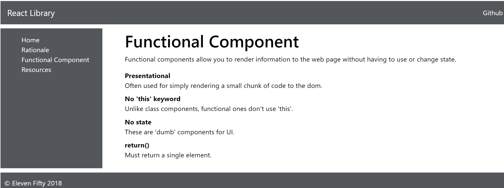

# Functional Component Challenge

Here's your challenge: Using `dl`, `dt`, and `dd` tags, refactor your FCDemo component so that it shows a list of notes about Functional Components. See the following image. If you are unfamiliar with these tags, you will have to research how to use them. 

### More Challenges
If you easily handle that, here are a few more thoughts for exploration. There is some freedom here: 

* Add more content about Functional Components in general.
* Do some original styling.
* Make usage of the reactstrap library that we've imported.
* Figure out how to use the codepen npm package that we've added by embedding a Codepen in your view. This anticipates a future lesson on 'props'. 
* You are free to make this tutorial site however you would like it to look.
* There is no 'right' answer to this part of the challenge.

