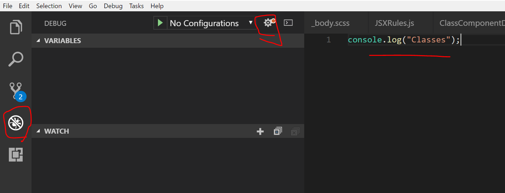
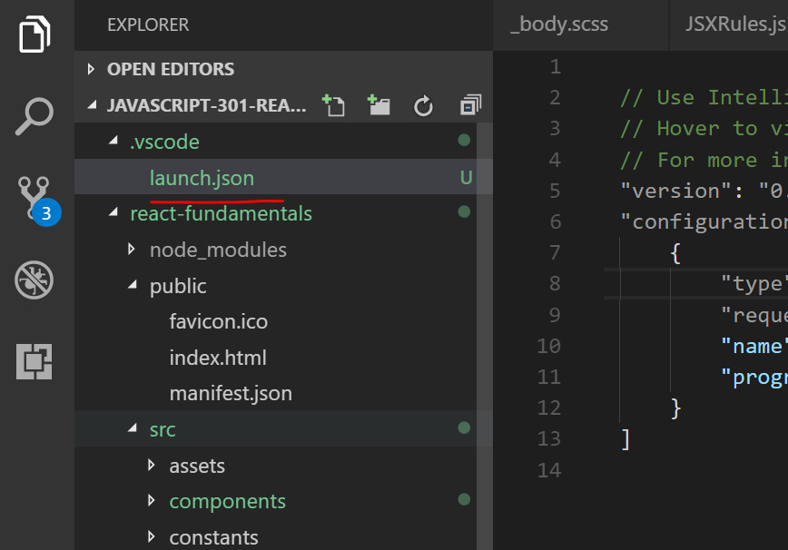
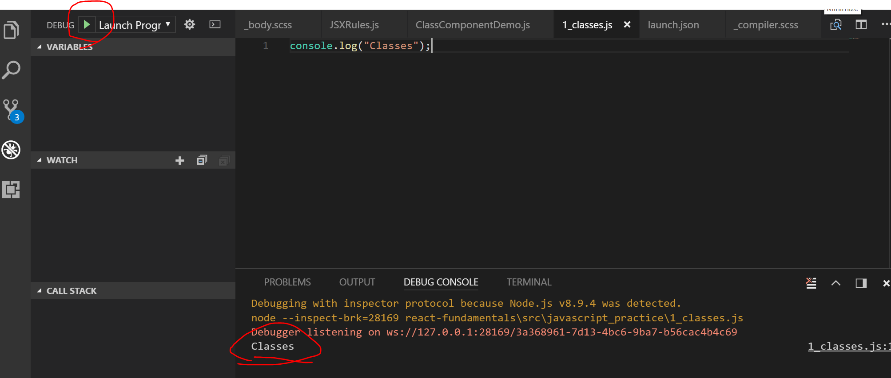

# ES6 Concept

If you don't already know, ES6 is a version of JavaScript. It is also known as ES2015. 

ES6 introduced concepts and keywords in JavaScript that are ubiquitous in React. In these modules we're going to study some ES6 concepts before we see how they are applied in React. Here's what we'll be studying:

* classes
* constructors
* extends
* super()
* string interpolation
* .map() (*This was part of ES5*)
* .filter()

These concepts are seen throughout React, so we're going to just do some simple examples and see how they apply to React classes. 

### Work files
In the first few modules of this section, we'll write some plain JavaScript. If you have a JavaScript library, then you can put these practice files in there. If you'd like to add them to your React project, that's fine too. You can just stow them away somewhere, possibly a separate directory. We're going to create a `javascript_practice` directory for this project. Just so you know, these files are playground files and won't be used in actual components. Again, we're aiming to give you a scaffolded understanding of the JS concepts that would be found in a React project. Let's get started.

```
    └── src
        └── assets
        └── components
        └── constants
        └── javascript_practice
            └── 1_classes.js
            └── 2_constructors.js
            └── 3_extends.js
            └── 4_super.js
            └── 5_interpolation.js
            └── 6_map.js
            └── 7_filter.js

            
```


#### Setting up `tasks.json`

Before starting, let's set up a Node launch configuration so that we can see the result of our code in VS Code. Follow these steps. It doesn't take long. If something doesn't work for some reason and you don't have immediate assistance, find an environment where you can run ES6 in the console.

1. Go ahead and go into `1_classes.js`. 
2. Add `console.log('Classes file');`
3. Click on the Debug icon in the left sidebar in VS Code.
4. Click the Settings gear.

5. The top option should be `Node.js`. Choose that one.
6. You should see the `launch.json` file.

7. If you open File Explorer again, you should see a VS Code folder with `launch.json` in it.


8. Go back to the Debug menu.
9. Open the `1_class.js` file. 
10. At the top of the Debug menu, click the Run button.
11. A Node repl window should pop up with your console log.


12. In order to see your console messages and build your .js files, you will need to add to the configuration array for each of the upcoming ES6 concept modules. Might as well just do that now.
13. Go into launch.json and copy the item in the configuration array. Don't copy ourse, it might be a different path. Copy your own:
```js
        {
            "type": "node",
            "request": "launch",
            "name": "Launch Program",
            "program": "${workspaceFolder}/react-fundamentals\\src\\javascript_practice\\1_classes.js"
        },
```
14. Paste it 5 times.
15. Then, change the file name in the `program` property to the corresponding files that we've created. It should look something like this:

```js
{
    // Use IntelliSense to learn about possible attributes.
    // Hover to view descriptions of existing attributes.
    // For more information, visit: https://go.microsoft.com/fwlink/?linkid=830387
    "version": "0.2.0",
    "configurations": [
        {
            "type": "node",
            "request": "launch",
            "name": "Launch Program",
            "program": "${workspaceFolder}/react-fundamentals\\src\\javascript_practice\\6_map.js"
        },
        {
            "type": "node",
            "request": "launch",
            "name": "Launch Program",
            "program": "${workspaceFolder}/react-fundamentals\\src\\javascript_practice\\5_interpolation.js"
        },
        {
            "type": "node",
            "request": "launch",
            "name": "Launch Program",
            "program": "${workspaceFolder}/react-fundamentals\\src\\javascript_practice\\5_super.js"
        },
        {
            "type": "node",
            "request": "launch",
            "name": "Launch Program",
            "program": "${workspaceFolder}/react-fundamentals\\src\\javascript_practice\\3_extends.js"
        },
        {
            "type": "node",
            "request": "launch",
            "name": "Launch Program",
            "program": "${workspaceFolder}/react-fundamentals\\src\\javascript_practice\\2_constructors.js"
        },
        {
            "type": "node",
            "request": "launch",
            "name": "Launch Program",
            "program": "${workspaceFolder}/react-fundamentals\\src\\javascript_practice\\1_classes.js"
        },
    ]
}
```
