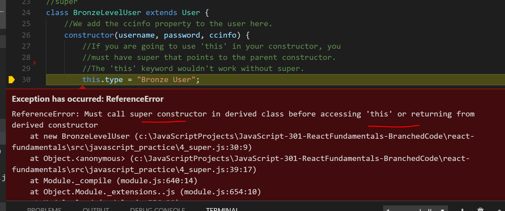

# super

The purpose of the super() function in a constructor is important to know, especially for React developers. To start out, it's best to go to the [MDN docs](https://developer.mozilla.org/en-US/docs/Web/JavaScript/Reference/Operators/super) and take a look. Take a quick scan and come back.

Let's use that same `User` class that we've been working with.

```js
//ES6 JS Classes
class User {
    constructor(username, password) {
        this.name = username;
        this.password = password;
        this.type = "Trial User"
    }
    //Method 1
    greet() {
        console.log('Welcome back,' + this.name);
    }
    //Method 2
    status() {
        console.log('Current status: ' + this.type);
    }
}

//Instance of the class/new object
var anonDude = new User("Anonymous");
anonDude.greet();
anonDude.status();
```

This is the exact same thing that we've done in the last few modules, so it shouldn't require much explanation. Let's add a different class, a BronzeLevelUser class. This is someone who pays for the lowest level subscription on our site. So with this, we'll just say we'll take in their cc information(which you shouldn't do btw, let Stripe do that).  

Let's look at some code though:

```js
//super
class BronzeLevelUser extends User {
    //We add the ccinfo property to the user here.
    constructor(username, password, ccinfo) {
     
        this.type = "Bronze User";
        this.ccinfo = ccinfo; 
    }

    getInfo(){
        console.log(this.username, this.password, this.type, this.ccinfo);
    }
}

var bronzeGuy = new BronzeLevelUser("Bronze Dude", "bronze7589", "4242424242424242");
bronzeGuy.greet();
bronzeGuy.status();
console.log(bronzeGuy);

```

So, when you try to run this, you should receive an error. It should say something like this:



The problem here is that JavaScript requires us to call the super() function inside of our constructor inside of derived classes. Otherwise, we can't use the `this` keyword. Here's the fix:


```js
//super
class BronzeLevelUser extends User {
    constructor(username, password, ccinfo) {
        //If you are going to use 'this' in your constructor, you 
        //must have super that points to the parent constructor.   
        super(username, password);
        //The 'this' keyword wouldn't work without super.
        this.type = "Bronze User";
        this.ccinfo = ccinfo; 
    }
}

var bronzeGuy = new BronzeLevelUser("Bronze Dude", "bronze7589", "4242424242424242");
bronzeGuy.greet();
bronzeGuy.status();
console.log(bronzeGuy);


```
This should yield a better result. We'll see prominent use of the `this` keyword in React Class Components, so it's important to have this knowledge now. This will give you a good enough baseline to get started though. 