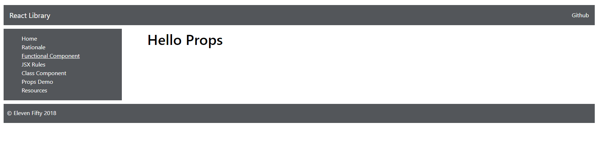
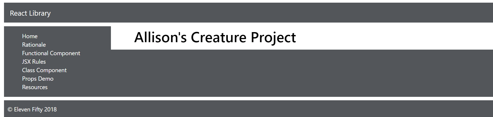
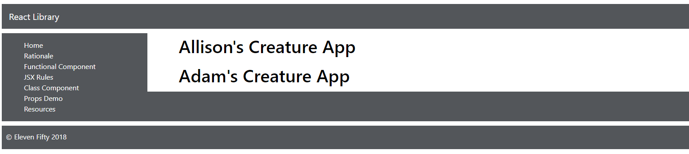

# Props 
Let's get started with props by adding a single prop to a Class Component called `PropsDemo`. We'll use this component as our base component through these modules. Here you will start to get a cursory understanding of props in React. 

### Class Components w/ props

To learn props, it's best to have a working example to play around with. Let's build one out:

In the `components/concepts` folder create a new file called `PropsDemo.js`. 

Let's import react in the file.  

```js
import React from 'react';
```

In your terminal let's add a package called 'prop-types'. This package isn't necessary, it's just going to allow us to set some defaults for using prop. More on this later. Install it by running the following:

 `npm install prop-types --save` 
 

Add the import for that package in the `PropsDemo.js`: 

```js
import React from 'react';
+ import PropTypes from 'prop-types';
```

Now set up a regular class component called `PropsDemo.js`:

```js
export default class PropsDemo extends React.Component {
    render() {
        return (
            <div className="main">
                <div className="mainDiv">


                </div>
            </div>
        )
    }
}

```

Next, add the following code inside of an `h1` tag inside of the Class Component:
```js
export default class PropsDemo extends React.Component {
    render() {
        return (
            <div className="main">
                <div className="mainDiv">

                    <h1>{this.props.title}</h1>

                </div>
            </div>
        )
    }
}

```


Below the closing curly braces of the class, add the following code: 

```js
PropsDemo.propTypes = {
    title: PropTypes.string.isRequired
}

PropsDemo.defaultProps = {
    title: 'Hello Props'
}
```

The component is now set up, so let's get it firing. Go to `routes.js` and add the following import:

```js
    import PropsDemo from '../concepts/PropsDemo';
```

Add a route for the `PropsDemo` component to fire called `routes.js`: 

```js
    {
      path: '/propsdemo',
      exact: true,
      main: () => <PropsDemo />
    },
```

Let's also add the sidebar link:

```js
        <li><Link to="/propsdemo">Props Demo</Link></li>
```


Go ahead and run the app. You should see the following:




Now, let's go ahead and add a new value for our prop.  We add a value for our property much like we would an HTML property. Think of an HTML attribute property:

```html
<h1 class="some-foo-attribute-here">
```

Keep this concept in mind as you use props in React. Here's how you would pass in a value for a prop:

```js
    {
      path: '/propsdemo',
      exact: true,
      main: () => <PropsDemo title="Allison's Creature Project" />
    },
```

You should see the new title when running the application:



### Explanation

Let's reflect a little on what's happening with the `title` property here. In the component, when we say `this.props.title`, we give ourselves the ability to add a `title` propety when we call the component. 

```js
<PropsDemo title="Allison's Creature Project" />
```

We could call the component multiple times in our `route.js` file, and we can give the property a new value each time. For instance, try the following code in `route.js`:

```js
    {
      path: '/propsdemo',
      exact: true,
      main: () => <div>
                    <PropsDemo title="Allison's Creature App"/>
                    <PropsDemo title="Adam's Creature App"/>
                </div>
    },
```

You should now get this when you run the app:



Hopefully, this is beginning to elucidate the idea of props in some way. We can use it to set different values using multiple instances of the same component. We have created two different instances of the same component with two different values for the title property. 

Remember back to our discussion of classes in ES6. The `this` keyword is part of a class, and it will refer to *this* instance of the component. The interpolation below allows us to render the different the title properties that are passed in when the component is called:

```js
<h1>{this.props.title}</h1>
```

### this keyword
Again, we now have two instances of the component. Each component has a separate value for the title property. So, think of it like this: when *this.props.title* gets called, it asks: "What is the title value of *this* instance of the component?" 

Thinking in this manner, will start to help you wrap your head around the `this` keyword.

### props origin
Another question you might ask, is 'Where does the word props come from?' Well, tbe `props` keyword is baked into React itself. You don't need to go do this, but if you looked into your node_modules and found the `react` folder, you could dig into some of the React library and find `props` in there, just like you would find `state`. Props are imported when we import React.

### prop-types
There's also probably some question for the items we added under the class component. We imported the `prop-types` package, and that allows us to make it so that the title property `isRequired`. 

Since a title value is required, what would happen if we don't have a value? This is the reason that we also include a `default` value to be set as the temporary parent of the `PropsDemo` component. Remember that rendered the default value before we passed in our own title string to the component call. If no string value is added when the component is called, we have this default one to share. 

Just so you know, you won't see the `prop-types` package in every component with props. It's simply a handy wayof setting some requirements, safety mechanisms and defaults on our components' properties.  

Let's keep playing with props in the next module.


