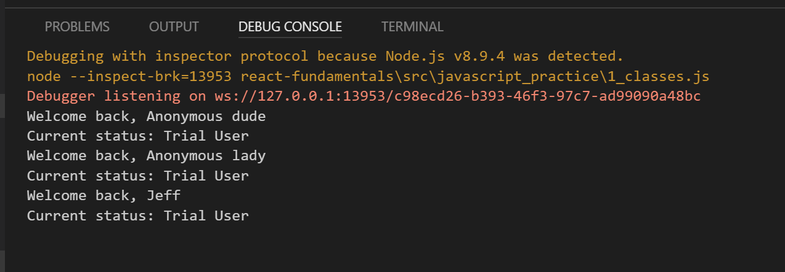

# 2.1: classes

If you don't already know, classes are a part of ES6. Classes are one of the most commonly used tools in React to build dynamic components, so it helps to have a strong foundation with classes before using them with React. Classes are not a new part of programming. Java, C\#, and many other Object Oriented Languages have classes, which act as a blueprint for creating objects that share methods and properties.

But if you are coming from any kind of background with Java, C\#, or C++, you should know that classes in JS aren't exactly the same as those languages. As the [MDN docs](https://developer.mozilla.org/en-US/docs/Web/JavaScript/Reference/Classes) describe, they are syntactic sugar for JavaScript's prototypal inheritance. We recommend you study those docs, and familiarize yourself with the above classes even after we walk through it here.

Enough chatter. Let's get started.

## Creating a class

Let's create a class called User:

```javascript
//ES6 JS Classes
class User {
    constructor(name){
      this.name = name;
      this.type = "Trial User"
    }
    //Method 1
    greet(){
      console.log('Welcome back, ' + this.name);
    }
    //Method 2
    status(){
      console.log('Current status: ' + this.type);
    }
  }
```

Just a note for this module, let's ignore the constructor. We'll discuss that next.

Let's start with a higher level view of classes. We like to explain a class as a sort of blueprint for making objects. We'll also talk about it as a sort of cookie cutter. Think about this: If you had to make 1000 cookies for a 1000 kids, you are going to need a cutter. You're not going to use a kitchen knife, right? A class is the cutter that cuts cookies or objects, the actual tool, a blueprint for what kind of properties the cookie will have.

We use that class to make `new` objects or instances of the class. Each of these objects can have different values for properties. Icing would be a property of a cookie class. Each cookie will have it's own value for that property: white, red, blue, or no icing on that particular instance of cookie. Make sense?

## Making Objects/Instances

We'll add to this class and break it down in future modules, but for now, let's learn to make objects/instances of the class. We make instances or objects from the class using the `new` keyword. Here's how we do that:

```javascript
  //Instance of the class/new object
  var anonDude = new User("Anonymous dude");

  //we can now use the instance and the . operator 
  // to access the 2 methods
  anonDude.greet();
  anonDude.status();

  //Another instance of the class
  var anonLady = new User("Anonymous lady");
  anonLady.greet();
  anonLady.status();

   //Another instance of the class
  var jeff = new User("Jeff");
  jeff.greet();
  jeff.status();
```

When we run this in the Node console, we get the following result:



## Notes

Here are a couple things to note: 1. We have three different instances of the User class. Three different cookies. 2. The . operator allows each instance of the class to 'access' the methods\(functions\) in the class. 3. Each instance has a different result in the console based on the string that is passed in to the constructor. Let's clarify that in the next module. 4. Before you move on, see if you can create 2 new instances of the class from memory.

