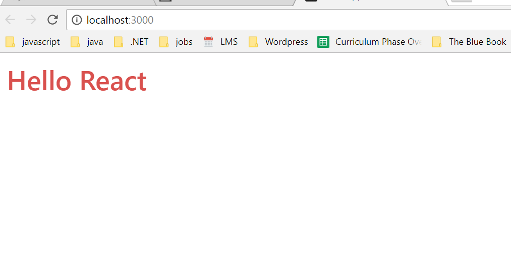

# 3.1: Calling Functional Components

A Functional Component is essentially a function, so like a function, we need to call the function to use it. Most of the time, when you call an instance of a component, it will be called similarly to an HTML self-closing tag, and the call should generally be the same name as the component itself. So for instance, this component is called FunctionalComponentDemo, so we'll call it like this

`<FunctionalComponentDemo />`

## Where to call it?

Let's play around a little bit so that you can see how to call a component.

1. Go to `App.js`.
2. Add an import for the Functional Component file. 
3. Remove the items inside the tags currently inside the div tag.
4. Add the call of the component `<FunctionalComponentDemo />`. 

```javascript
*****************************
Some Imports omitted
*****************************
+ import FunctionalComponentDemo from './components/concepts/FunctionalComponentDemo.js';
import Sidebar from './components/site/Sidebar'

class App extends Component {
  render() {
    return (
      <div>
        <FunctionalComponentDemo />
      </div>
    );
  }
}

export default App;
```

One more quick change: 1. Go to `App.css`. 2. Change the text color to red: `color: red`. 3. You can remove the `background-color: white;` rule, if you have it.

```css
/****************************
Body Section
****************************/
body {
    padding: 15px;
    color: red;
    font: Belleza;
}
```

Run `npm start`. You should see the following:



## Quick Explanation

So what's happening here? 1. We have the FunctionalComponentDemo Component. 2. Which is being called in `App.js`. 3. `App.js` is being called inside of `index.js`. 4. `index.js` has a ReactDOM.render\(\) method where `<App />` is passed in as a parameter. 4. `index.js` is reaching out to the root in the `index.html` file where it is being rendered.

Notice how there is a sort of flow to the data here. It goes through a channel where it eventually finds the HTML. The FCDemo Component is a child of the App Component. The App Component is a child of index, and index is the main parent Component. This unidirectional flow is what people love about React.

**Rule**: _Data flows in one direction in React._

When you run the app, we want it to look like this:


Unfortunately during our demo we removed some code from `App.js`. Let's take the app back to where it was. You'll need to change the `App.js` file and the `App.css` file back by hitting `ctrl + z`. It should do it even if you have saved, _unless the file has been closed since it was last edited_. If not, here is the `App.js` for your convenience:

```javascript
import React, { Component } from 'react';
import 'bootstrap/dist/css/bootstrap.css';
import './App.css';
import Header from './components/site/Header'
import Footer from './components/site/Footer'
import Sidebar from './components/site/Sidebar'
import {
  BrowserRouter as Router,
} from 'react-router-dom';

class App extends Component {
  render() {
    return (
      <div>
        <Header />
        <Router>
          <Sidebar />
        </Router>
        <Footer />
      </div>
    );
  }
}

export default App;
```

and here is part of the `App.css` file:

```javascript
/****************************
Body Section
****************************/
body {
  padding: 15px;
  color: white;
  font: Belleza;
}
```

## Sidedbar.js

With our current routing, to get the Component firing properly we need to call the Components in our `Sidebar.js` file where we're doing all of our routes. Note the plusses to see what we've added.

```javascript
import React from 'react'

import {
  Route,
  Link,
  Switch
} from 'react-router-dom'

import Home from './Home'
import Resources from './Resources'
+ import FunctionalComponentDemo from '../concepts/FunctionalComponentDemo'


const Sidebar = () => (

  <div className="sidebar">
    <div className="sidebar-list-styling">
      <ul className="sidebar-list list-unstyled">
        <li><Link to="/">Home</Link></li>
        <li><Link to="/rationale">Rationale</Link></li>
        <li><Link to="/functionalcomponent">Functional Component</Link></li>
        <li><Link to="/resources">Resources</Link></li>

      </ul>
    </div>
    <div className="sidebar-route">
        <Switch>
            <Route exact path="/home"><Home /></Route>
            <Route exact path="/resources"><Resources /></Route>
            <Route exact path="/"><Home /></Route>
+           <Route exact path="/functionalcomponent"><FunctionalComponentDemo /></Route>
        </Switch>
    </div>
  </div>

)

export default Sidebar;
```

Notice that we're adding it as an import. Then, we're also adding a path, `/functionalcomponent`. When we go to that path it will fire the Component.

## Styling

Let's add some classes that we already made in `App.css` for simple styling in the Functional Component. In your FunctionalComponentDemo.js, add the `className` attributes and string values.

```javascript
import React from 'react';

const FunctionalComponentDemo = function () {
    return (
+        <div className="main">
+            <div className="mainDiv">
                Hello React
+            </div>
+        </div>
    );
};

export default FunctionalComponentDemo;
```

At this point when you click on the "Functional Component" link in the sidebar, your app should look like this:


Let's take a look at the next module.

