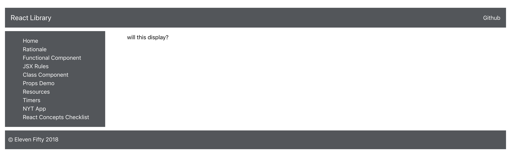

# 6.1: Props Demo and Challenge 1

Let's begin to understand props by creating a Class Component that will pass props to a Functional Component. We'll stick with these two components as we move forward throughout this module. They should provide you the tools to gain a cursory understanding of props in React.

## Class Components with Props

To learn props, it's best to have a working example to play around with. Let's build one out:

In the `components/concepts` folder create a new file called `PropsDemo.js`.

Let's import react in the file.

```javascript
import React from 'react';
```

Let's set up a regular class component called `PropsDemo.js`:

```javascript
export default class PropsDemo extends React.Component {
    render() {
        return (
            <div>
                <FunctionalComp string="will this display?"/>
            </div>
        )
    }
}
```

This class component is passing a prop of 'string' to our functional component, which still needs to be built out. Let's build our functional component out below. It will be contained in the same file as `PropsDemo`, just below the `PropsDemo` component.

## Functional Component Using Props

```javascript
const FunctionalComp = (props) => {
    return(
        <div>
            <p>{props.string}</p>
        </div>
    )
}
```

If you run your project, can you see output in Chrome? If not, great! That's to be expected. We still need to add a link from our Sidebar component and route from that link. Let's start by importing PropsDemo into `Sidebar.js`.

```javascript
import PropsDemo from '../concepts/PropsDemo';
```

Let's add the following Link in our Sidebar.js file:

```javascript
<li><Link to="/propsdemo">Props Demo</Link></li>
```

Finally, let's add a route that will be triggered upon the propsdemo link being clicked:

```javascript
<Route exact path="/propsdemo"><PropsDemo/></Route>
```

Now when you click on the propsdemo link from the sidebar you should be able to view the following: 

Let's consider what has been built out here. In the class component, you have called a functional component with the prop 'string'. This class is not responsible for displaying to the DOM. It only calls a child component \(the functional component\) which handles all of the DOM display. The functional component itself doesn't actually display a specific value. The information contained inside the `<p>` tags is determined by the props object passed to the functional component. `{props.string}` shows whatever the value of `string` is from the prop.

Your challenge to be completed before you move to the next page is to make 3 more component calls to `FunctionalComp` inside of `PropsDemo` \(so you'll have 4 total\). For each of these component calls, pass a prop of `string` that will display a string of your choosing. A sample solution will be shared on the next page.

