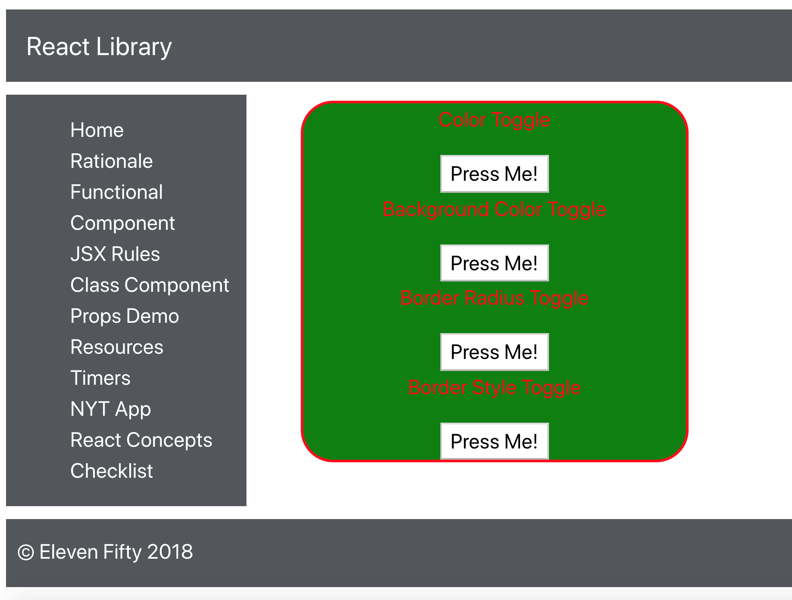

# 6.4: Props Answer 2

The below code represents one possible solution for the challenge. You may want to put these 3 methods between your constructor and render in your class component.

```javascript
backgroundColorToggle = () => {
    this.setState({
        backgroundColor: this.state.backgroundColor === 'blue' ? 'green' : 'blue'
    })  
}

borderRadiusToggle = () => {
    this.setState({
        borderRadius: this.state.borderRadius === '5px' ? '25px' : '5px'
    })  
}

borderStyleToggle = () => {
    this.setState({
        borderStyle: this.state.borderStyle === 'dashed' ? 'solid' : 'dashed'
    })  
}
```

In addition to the methods built out above, you'll want to modify your `function` props in each of the `FunctionalComp` calls. I've also changed the values of the `string` props to make sure it's clear to the user what each button will do. Here is a sample solution:

```javascript
    <FunctionalComp string="Color Toggle" function={this.colorToggle}/>
    <FunctionalComp string="Background Color Toggle" function={this.backgroundColorToggle}/>
    <FunctionalComp string="Border Radius Toggle" function={this.borderRadiusToggle}/>
    <FunctionalComp string="Border Style Toggle" function={this.borderStyleToggle}/>
```

When this is set up, you should be able to toggle each button and see a change in the DOM. Below is a screen capture of what your DOM can look like when you've clicked every button once:



Take a second to evaluate what your code is doing. This is pretty cool--first, you're delegating DOM display out of the parent class component into the functional component 'below' it. You're also using methods built in that same parent component and sharing them with the child. The child triggers that function, which still changes properties of the class parent component \(state, in this case\). React is filled with these instances of parent-child communication. It's both a strength and a limitation of working with this environment!

