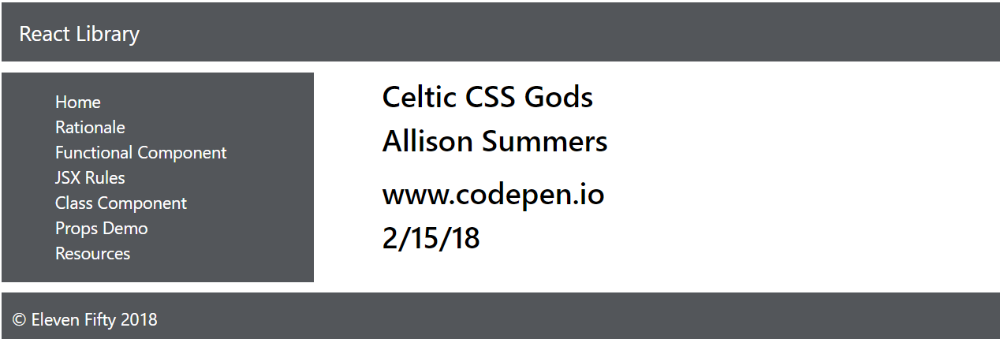

# 6.4: Props Challenge \#2

Let's keep practicing props through small challenges. This time we're asking you to start with a refactor. Your first step is to take out the instances of the component in `_routes.js` and get it back to a simple call of the component. It should look like this, with no props being passed in:

```javascript
    {
      path: '/propsdemo',
      exact: true,
      main: () => <PropsDemo />
    },
```

Then, in `PropsDemo.js`, we want to have the PropsDemo Component look like this:

```javascript
import React, { Component } from 'react';
import PropTypes from 'prop-types';

export default class PropsDemo extends Component {
    render() {
        return (
            <div className="main">
                <div className="mainDiv">
                    <Title title="Celtic CSS Gods" />
                    <Author author="Allison Summers" />
                    <CodepenUrl codepenUrl="www.codepen.io" />
                    <Footer date="2/15/18" /> 
                </div>
            </div>
        );
    }
}
```

Notice that we have several components now, and they all take in props. Your challenge is to build those components and to build them as class components. You should also have defaults for each property in each component, and they should all be required components.



