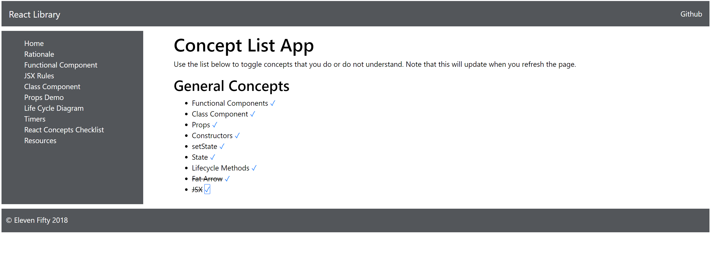

# 2.3 - Concept Component

Okay, now that we've got our two functional children classes, `ConceptList` and `Concept`, we can go ahead and work on the logic in our `ReactConceptsApp` component.

## imports

First thing we can do is add our new `ConceptList` component to our imports. All the imports together should now look like this:

```javascript
import React, { Component } from 'react';
import _ from 'lodash';
import ConceptList from './ConceptList';
import { concepts } from './concepts';
```

## render\(\)

Additionally, now that we've set up our child components, we can now update our render to use these components. We need to use our `ConceptList` component, and set its props of concepts and toggle. So we can pass along our state to concepts, and we need to create a method to pass to `toggle`. Let's go ahead and just call it `toggleConcept` and set up our `render()` to look like this.

```javascript
    render() {
        return (
            <div className="main">
                <div className="mainDiv">
                    <h1>Concept List App</h1>
                    <p>Use the list below to toggle concepts that you do or do not understand. Note that this will update when you refresh the page.</p>
                    <h2>General Concepts</h2>
                    <ConceptList concepts={this.state.concepts} toggle={this.toggleConcept.bind(this)} />
                </div>
            </div>
        );
    }
```

## toggleConcept

Now, we're calling a custom function called `toggleConcept`, but we need to actually define what `toggleConcept` does. Our objective is to take the concepts and compare them against the concept list, using the lodash `find` method.

This `find` method compares a collection to a second thing \(in this case `concepts`\) and returns the first thing it finds truthy for. Then, we need it to set concept.done to the opposite of what it currently is, essentially toggling it. Yea, `lodash` is sweet.

Finally, we need to set state back to include the updated toggle on `done`. To see for yourself, what concepts looks like when it comes back, feel free to add a `console.log` at the first line of the method.

```javascript
    toggleConcept(concepts) {
        let concept = _.find(this.state.concepts, concepts);
        concept.done = !concept.done;
        this.setState({concepts: this.state.concepts});
    }
```

## The View:

Here's what you should currently see in the app:



## Completed Code

To see the complete code for ReactConceptsApp so far, check below to make sure yours matches up.

```javascript
import React, { Component } from 'react';
import _ from 'lodash';
import ConceptList from './ConceptList';
import { concepts } from './concepts';

export default class ReactConceptsApp extends Component {
    constructor() {
        super(); 
        this.state = { concepts: concepts };
    }

    toggleConcept(concepts) {
        let concept = _.find(this.state.concepts, concepts);
        concept.done = !concept.done;
        this.setState({concepts: this.state.concepts});
    }

    render() {
        return (
            <div className="main">
                <div className="mainDiv">
                    <h1>Concept List App</h1>
                    <p>Use the list below to toggle concepts that you do or do not understand. Note that this will update when you refresh the page.</p>
                    <h2>General Concepts</h2>
                    <ConceptList concepts={this.state.concepts} toggle={this.toggleConcept.bind(this)} />
                </div>
            </div>
        );
    }
}
```

Next, we're going to figure out how to add a new concept.

[Creating a new Concept!](2.4-concept-list-component.md)

