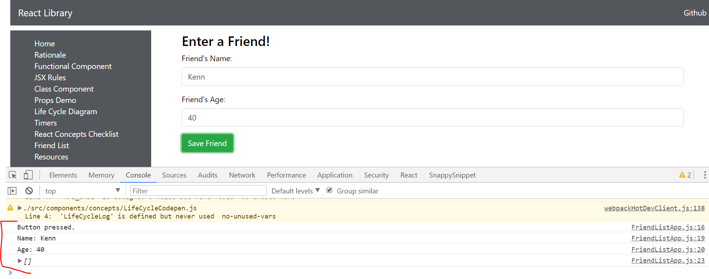

# 4.1 - Friend List App Component

This app will be highly useful in illustrating how to pass data from a form using React. Chances are, you'll have to do it. You'll notice some patterns from previous applications, just different syntax.

## imports and API\_Base

Set up a few imports and a class component. See the code below. We encourage you to type everything except for the API\_BASE.

```javascript
import React, { Component } from 'react';

const API_BASE = "http://rest.learncode.academy/api/efa/friends";

class FriendListApp extends Component {
    render() {
        return (
            <div className="main">
                <div className="mainDiv">
                    Placeholder for an input form.
                </div>
            </div>
        );
    }
}

export default FriendListApp;
```

Just like in plain JavaScript files, we're keeping our API\_BASE capitalized because it is convention to put caps on constants, and this is a base that will be a constant.

## Friend List App Form

Let's create a Friend List App form now inside of the render and inside of our two container divs. Note that we put some extra space for clarity:

```javascript
class FriendListApp extends Component {
    render() {
        return (
            <div className="main">
                <div className="mainDiv">


                ***********    Start the form ***********
                  <form>
                    <h3>Enter a Friend!</h3>
                    <fieldset className="form-group">
                      <label>Friend's Name:</label>
                      <input
                        type="text"
                        ref="name"
                        name="name"
                        className="form-control"
                      />
                    </fieldset>

                    <fieldset className="form-group">
                      <label>Friend's Age:</label>
                      <input
                        type="text"
                        ref="age"
                        name="age"
                        className="form-control"
                      />
                    </fieldset>
                    <button className="btn btn-success" type="submit">
                      Save Friend
                    </button>
                  </form>
                ***********    Finish the form ***********
                </div>
            </div>
        );
    }
}

export default FriendListApp;
```

## Add the routes

We need to get our routes set up.

1. Just so you can practice and get stronger, we'll leave it up to you to go to `Sidebar.js` and do this. We are calling our route 'friendlist'. Don't forget that examples of adding a route are available in Part 1, section 1.4.
2. When you fire up the app, and go to that route, you should get a form with two input fields and a button. Again, you should see something like this form in this app at this point (styling may be different, you can always style later):


Of course, if you press submit, there is no data being passed. We are going to need a method for that.

## Constructor and friends array

We are going to need an array for our collection of friends. Just like in the past, we are going to set the state of the array in our constructor, before anything renders:

```javascript
class FriendListApp extends Component {

    ************ Add ***********
    constructor(props) {
        super(props);
        this.state = { friends: [] }
        console.log('Constructor',this.state.friends)
    }
    ************ Finish Add ***********
```

We pass in props, as we've discussed in the past, and we set the initial state to having a blank array called `friends`. Remember that you can console log the state by `console.log(this.state.friends)` right before the closing curly brace. You should see the empty array in Chrome:


## Add a handleSubmit method

A good way to wire up a button with a method is to first simply log something when you press the button. We'll now add a `handleSubmit()` method. Eventually, this will take care of our http post. First, we need to set up some variables inside the method:

```javascript
    constructor(props) {
        super(props);
        this.state = { friends: [] }
    }

    ********** add ***********
    handleSubmit = event => {
        event.preventDefault();
        console.log("Button pressed.");
        var name = this.refs.name.value;
        var age = this.refs.age.value;
        console.log("Name:", name);
        console.log("Age:", age);

        var friendsTemp = this.state.friends;
        console.log(friendsTemp);
    }

        ********** add ***********
```

It's important to note that handleSubmit is not a React method. It's not a life cycle method or any other built in method in the React API.

_It's just a convention that is used by React developers to call something that is handling some event with the word 'handle' as the starting word in the method signature._

## Call onSubmit\(\)

Nothing is happening yet though. We need to connect the button to the method. Let's call this function in the form. We can call it in the the onSubmit of the form:

```javascript
    render() {
        return (
            <div className="main">
                <div className="mainDiv">
                        *********** Call handleSubmit ***************

                            <form onSubmit={this.handleSubmit.bind(this)}>

                        *********** Addition done *******************
                                <h3>Enter a Friend!</h3>
```

Now, when we press the button, our console.log in the `handleSubmit` method should fire off. You should see this: 



## Fetch

So we now have the button hooked up and we need to pass that data off to our API. To do that we'll use fetch to make a post request to the api url. For clarity, we went ahead and tore out the `console.log` methods in the `handleSubmit` method. You can keep them, if you'd like. Under the newly created variables let's add the following post request:

```javascript
    handleSubmit = event => {
    event.preventDefault();
    var name = this.refs.name.value;
    var age = this.refs.age.value;
    var friendsTemp = this.state.friends;
******* START ADD *******
    fetch(API_BASE, {
      method: "POST",
      headers: {
        "Content-Type": "application/json",
      },
      body: JSON.stringify({ name, age })
    })
      .then(res => res.json())
      .then(response => {
        friendsTemp.push(response.data)
        this.setState({ friends: friendsTemp })
        this.refs.name.value = ""
        this.refs.age.value = ""
        console.log(response)
      })
******** END ADD **********
  }
```

You should get the response data back in the console. Woohoo! 


Notice also that the form clears when we hit submit. That's because we used `refs` again, where we set `this.refs.name.value=""`. As we get the response from the server, we set the input fields to blank strings. This is handy to know!

## The Final Code

In the next module we'll create the actual `Friend` component. Here is the final code for this section:

```javascript
import React, { Component } from "react";

const API_BASE = "http://rest.learncode.academy/api/efa/friends";

class FriendListApp extends Component {
  constructor(props) {
    super(props);
    this.state = { friends: [] };
  }

  handleSubmit = event => {
    event.preventDefault();
    var name = this.refs.name.value;
    var age = this.refs.age.value;
    var friendsTemp = this.state.friends;

    fetch(API_BASE, {
      method: "POST",
      headers: {
        "Content-Type": "application/json",
      },
      body: JSON.stringify({ name, age })
    })
      .then(res => res.json())
      .then(response => {
        friendsTemp.push(response.data)
        this.setState({ friends: friendsTemp })
        this.refs.name.value = ""
        this.refs.age.value = ""
        console.log(response)
      })
  }

  render() {
    return (
      <div className="main">
        <div className="mainDiv">
          <form onSubmit={this.handleSubmit.bind(this)}>
            <h3>Enter a Friend!</h3>
            <fieldset className="form-group">
              <label>Friend's Name:</label>
              <input
                type="text"
                ref="name"
                name="name"
                className="form-control"
              />
            </fieldset>

            <fieldset className="form-group">
              <label>Friend's Age:</label>
              <input
                type="text"
                ref="age"
                name="age"
                className="form-control"
              />
            </fieldset>
            <button className="btn btn-success" type="submit">
              Save Friend
            </button>
          </form>
        </div>
      </div>
    );
  }
}

export default FriendListApp;

```

