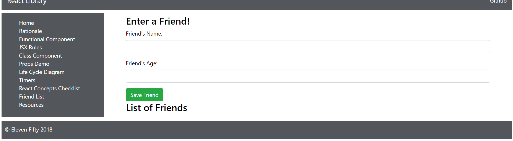

# 4.2 - Friend List Component

We'll now add another component for creating a list. This is the component that we referred to at the end of the last module before the final code block. Now, let's implement it.

## FriendList

We have the data firing, but we have no way of showing it. We need to show the data in a list. Let's stub out everything we'll need here. We'll code with intent here, thinking about what we'll want to be able to do starting with creating a new file called FriendList.js inside the same directory as FriendListApp.js

Go into the `FriendList.js` file and add the following.

```javascript
import React, { Component } from 'react';
import axios from 'axios';
import FaTrashO from 'react-icons/lib/fa/trash-o'

const API_BASE = "http://rest.learncode.academy/api/efa/friends";

class FriendList extends Component {

    constructor(props) {
        super(props)
        this.state = { friends: [] };
    }

    componentWillReceiveProps(nextProps) {

    }

    renderFriends() {

    }

    removeFriend(event, friend) {

    }

    render() {
        return (
            <div>
                Friend
            </div>
        );
    }
}

export default FriendList;
```

We know in advance that we'll want to render and remove friends, so we added those methods. Remember that `componentWillReceiveProps` is a life cycle method that re-renders or “Reacts” to any new props passed to the component. So if someone adds someone else to the list, this will fire and rerender the FriendList component. `nextProps` is a convention to help us increase readability of the code.

There is a lot to do, and we'll try writing this in a flow that represents real application creation. The best work flow for this will probably be the following:

1. Implement\(write\) the renderFriends\(\) method.
2. Call renderFriends\(\) in render\(\) inside the `FriendList` component.
3. Write the implementation for `componentWillReceiveProps()`.
4. Create an instance of the `FriendList` component in the `FriendListApp` component in an iterable way. We will want to fire off this component for every friend.

## renderFriends\(\) method

We are going to need to map over our incoming data to create a list. So, we here's just some pseudo code to get us thinking about what we need to do. Sometimes writing in plain English can help us think through a problem:

```javascript
renderFriends() {
        if (this.state.friends) {
            //Need to map over the incoming data
            //Need to add a friend's name and age to a list item
        } else {
            //Need to show that we haven't received any data.
            //Either there are no friends coming in from the request
            //Something went wrong on the network
        }
    }
```

That's the kind of thinking we need here. Don't worry about how it's going to work. Think about what we need to do with the incoming data. Let's get started with the implementation of the if. Add the following code:

```javascript
renderFriends() {
        if (this.state.friends) {
            const friendsFiltered = this.state.friends.filter(friend => friend.id)
            return friendsFiltered.map(friend => 
                <div key={friend.id}>
                    <li className="list-group-item">
                        <strong>Name:</strong> {friend.name}
                        <br />
                        <strong>Age:</strong> {friend.age}
                        <button onClick={() => { this.removeFriend(this, friend) }}
                            className="btn btn-danger trash">
                            <span><FaTrashO /></span>
                        </button>
                    </li>
                </div>
            );
        }  else {
```

So, in the code above, we'll check if there's any friends in the list. If there are friends, we'll map over the array. Because React requires it, as we've learned in past modules, a unique key will be needed for each friend compartmentalize friend list item. In this instance our unique key that we're using is "id", which our friends should come back with if they're formatted correctly. In order to prevent against React errors, and ensure we're only displaying friends with an "id" we can use `.filter()` to make sure that our friends have an "id". Check out the code below to see how we use filter to create an array of `filteredFriends`.

`.filter()` is somewhat similar to `.map()`, but what filter does is a check on each item, and only returns those that match the check in a new array. So, for example, from the docs:

```javascript
var words = ['spray', 'limit', 'elite', 'exuberant', 'destruction', 'present'];

const result = words.filter(word => word.length > 6);

console.log(result);
// expected output: Array ["exuberant", "destruction", "present"]
```

```text
Now, let's write the else part of the conditional:

```js

    } else {
    **************Add code ***************
        return (
                <div>
                    <h1>Waiting for friends</h1>
                    {this.state}
                </div>
            );
        **************End code ***************

        }
    }
```

If we don't have friends in the array, we'll show a `Waiting for friends` message and keep a watch on the current state until we see a friend added.

## renderFriends\(\) call

Still inside of a list component, we need to fire off the method we just created. Notice that we are adding an unordered list tag to hold the method. This makes sense since the method creates individual friend list items.

```javascript
    render() {
        return (
            <div>
                <div>
                    <div className="col-xs-2">
                    </div>
                    <div className="col-xs-6">
                        <h3>List of Friends</h3>
                        <ul className="list-group friends">
                            {this.renderFriends()}
                        </ul>
                    </div>
                </div>
            </div>
        );
    }
}
```

## componentWillReceiveProps\(\)

This method will take in our incoming props and change the state on the component. Remember that when the state changes, the `FriendList` component will rerender and renderFriends\(\) will get called. This method is called when props are passed to the Component instance. We'll see how this works in more detail in the next step.

```javascript
componentWillReceiveProps(nextProps) {
        //console.log(nextProps);
        this.setState({ friends: nextProps.props})
        //console.log(this.state);
    }
```

## renderFriendsList\(\)

Move over to the `FriendListApp` component. We are going to pass in an instance of our `FriendList`. First, you should import the file at the top:

`import FriendList from './FriendList';`

Still in the `FriendsListApp` component, write a `renderFriendsList()` method as follows, right above the render\(\) method:

```javascript
    ******** Add ************
    renderFriendsList() {
        //console.log(this.state.friends);
        return <FriendList props={ this.state.friends } />
    }
    ******** End ************

    render() {
```

Here we're creating a method that will return a new instance of the FriendList that has props on it.

## handleSubmit addition

Let's also call the `renderFriendsList` in the `handleSubmit` method:

FriendListApp:

```javascript
    handleSubmit(event) {
        event.preventDefault();

        var name = this.refs.name.value;
        var age = this.refs.age.value;
        var friendsTemp = this.state.friends;
        axios.post(API_BASE, { name, age })
            .then( response => {
                friendsTemp.push(response.data);
                this.setState({ friends: friendsTemp });
                ********ADD THE CALL******
                this.renderFriendsList(this.state.friends);
                **************************
                this.refs.name.value = "";
                this.refs.age.value = "";
            });
    }
```

## renderFriendsList\(\)

We also need to carve out a space to render the list in our JSX. Once we have the list data, we can now render the list in this div space:

```javascript
                                <button className="btn btn-success" type="submit">Save Friend</button>
                            </form>
                        </div>

                    ********* Add *********
                    <div>
                        {this.renderFriendsList(this.state.friends)}
                    </div>
                    ********* End *********

                </div>
            </div>
        );
    }
}
```

When we run the app and add a friend, we should see the new friend added to the list of friends, as in this image:


## Experimentation

Take some time at this point to experiment with some of the console.logs that we have added. Toggle them on and off as you add friends. While we gave some starter points where possible, there is a lot to learn from just playing with the application here.

## constructor update

We have a problem. Try refreshing the app. You should get the form back, but it won't have the data: 



Go to `FriendListApp` and update the constructor. Add an axios request for when we first fire up the app. We want the app to make a request to get the data upon start up. We'll need to add a binding for the handle submit in our constructor.

```javascript
constructor(props) {
        super(props);
        this.state = { friends: [] }
        axios.get(API_BASE)
            .then( response => {
                this.setState({ friends: response.data });
                this.renderFriendsList(this.state.friends);
            });
        this.handleSubmit = this.handleSubmit.bind(this);
    }
```

## Code for this module

Here is the code for this module:

`FriendList.js`

```javascript
import React, { Component } from 'react';
import axios from 'axios';
import FaTrashO from 'react-icons/lib/fa/trash-o'

const API_BASE = "https://rest.learncode.academy/api/jameshandshoe/friends";

class FriendList extends Component {

    constructor(props) {
        super(props)
        this.state = { friends: [] };
    }

    componentWillReceiveProps(nextProps) {
        //console.log(nextProps);
        this.setState({ friends: nextProps.props })
        //console.log(this.state);
    }

renderFriends() {
        console.log(this.state.friends)
        if (this.state.friends) {
            const friendsFiltered = this.state.friends.filter(friend => friend.id)
            return friendsFiltered.map(friend => 
                <div key={friend.id}>
                    <li className="list-group-item">
                        <strong>Name:</strong> {friend.name}
                        <br />
                        <strong>Age:</strong> {friend.age}
                        <button onClick={() => { this.removeFriend(this, friend) }}
                            className="btn btn-danger trash">
                            <span><FaTrashO /></span>
                        </button>
                    </li>
                </div>
            );
        } else {
            return (
                <div>
                    <h1>Waiting for friends</h1>
                    {this.state}
                </div>
            );
        }

    }

    removeFriend(event, friend) {

    }

    render() {
        return (
            <div>
                <div>
                    <div className="col-xs-2">
                    </div>
                    <div className="col-xs-6">
                        <h3>List of Friends</h3>
                        <ul className="list-group friends">
                            {this.renderFriends()}
                        </ul>
                    </div>
                </div>
            </div>
        );
    }
}

export default FriendList;
```

`FriendListApp.js`

```javascript
import React, { Component } from 'react';
import axios from 'axios';
import FriendList from './FriendList';

const API_BASE = "http://rest.learncode.academy/api/efa/friends";

class FriendListApp extends Component {

    constructor(props) {
        super(props);
        this.state = { friends: [] }
        console.log("Constructor, state:", this.state.friends)
    }

    handleSubmit(event) {
        event.preventDefault();
        console.log("Button pressed.");
        var name = this.refs.name.value;
        var age = this.refs.age.value;
        console.log("Name:", name);
        console.log("Age:", age);

        var friendsTemp = this.state.friends;
        console.log(friendsTemp);

        axios.post(API_BASE, { name, age })
            .then(response => {
                friendsTemp.push(response.data);
                this.setState({ friends: friendsTemp });
                this.renderFriendsList(this.state.friends);
                this.refs.name.value = "";
                this.refs.age.value = "";
                console.log(response);
            });
    }

    renderFriendsList() {
        //console.log(this.state.friends);
        return <FriendList props={this.state.friends} />
    }

    render() {
        return (
            <div className="main">
                <div className="mainDiv">
                    <div className="col-xs-4">
                        <form onSubmit={this.handleSubmit.bind(this)}>
                            <h3>Enter a Friend!</h3>
                            <fieldset className="form-group">
                                <label>Friend's Name:</label>
                                <input type="text"
                                    ref="name"
                                    name="name"
                                    className="form-control"
                                />
                            </fieldset>

                            <fieldset className="form-group">
                                <label>Friend's Age:</label>
                                <input type="text"
                                    ref="age"
                                    name="age"
                                    className="form-control"
                                />
                            </fieldset>
                            <button className="btn btn-success" type="submit">Save Friend</button>
                        </form>
                    </div>
                    <div>
                        {this.renderFriendsList(this.state.friends)}
                    </div>
                </div>
            </div>
        );
    }
}

export default FriendListApp;
```

