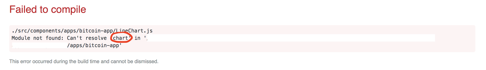

# 8.3 - Bitcoin API Line Chart

It is now time to move on to another file, `LineChart.js`. In it, we are going to import `React` and `Component` from react and setup our `LineChart` component. Let's also add our `render()` and throw an `h3` tag in our JSX to see that it's working.  


```text
import React, { Component } from 'react';

export default class LineChart extends Component {

  render() {
    return (
      <h3>Yay! Line Chart!</h3>
    );
  }
};
```

Now, it's time to link it with `Bitcoin.js`. Import `LineChart.js` and replace `<h3>Line Chart</h3>` with `<LineChart/>`. You should now see this:  


Great! Now we are linking `LineChart.js` with `Bitcoin.js`!

## Chart.js

There are many ways to display the data; we are going to show it in a graph, using [Chart.js](http://www.chartjs.org/). In the [docs](http://www.chartjs.org/docs/latest/getting-started/), we see that we need to install Chart.js.  


So, in your terminal, where you would normally run `npm start`, type in the following: `npm install chart.js --save`. Now we have to import it into `LineChart.js`. Add this to the top under your import of `React`: `import Chart from 'chart.js';`.  


## Quick Aside

In the past, when we have imported something from our package.json \(like React\), we have only needed to allude to that specific file like this: `'react'`. Why do we need to called Chart.js' file by `'chart.js'` instead of just `'chart'`? If we only type in `'chart'`, we get this:  




For this particular instance, Chart.js requires us to import explicitly from `'chart.js'`, rather than assume the `.js` part, like we in other instances.

## Building the Chart

We are now ready to include a chart from Chart.js. Again, if you look at the docs, they give an example of code to build out a bar graph. We, however, want a line graph. The code below is taking the example code directly from the Chart.js docs and changing bar to line, as well as adding some basic values to show the graph with data. That is all. Everything else is going to come out of the box from Chart.js--easy!  


Put in the following code in your component, above `render()`:  


```text
componentDidMount() {
  var chartContext = document.getElementById('myChart').getContext('2d');
  var myChart = new Chart(chartContext, {
    type: 'line',
    data: {
      labels: ['first','second','third','fourth'],
      datasets: [{
        data: [1,1,5,0],
        backgroundColor: 'rgba(54, 162, 235, 0.2)', 
        borderColor: 'rgba(54, 162, 235, 1)',
        borderWidth: 1
      }]
    },
    options: {
      scales: {
        yAxis: [{
          ticks: {
            beginAtZero: true
          }
        }]
      }
    }
  });
}
```

We now need to change our JSX to be able to see it. Replace `<h3>Yay! Line Chart!</h3>` with `<canvas id='myChart'></canvas>`. When you run it, you should see this:  


