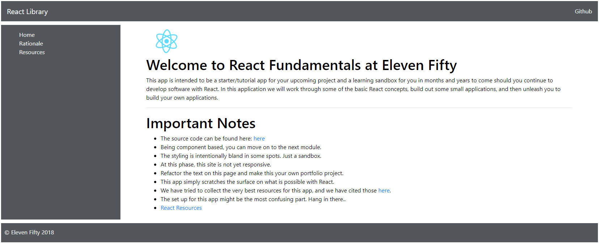

# Project Layout
In this module, we'll set up a layout for our tutorial site/playground/sandbox. Here's what we'll be doing:
1. Set up the basic routing for our site using React Router.
2. Use a library called reactstrap for easy use of Bootstrap Components in our project.
3. We'll set up our initial Components for structuring the app.
4. We'll set up a small amount of styling for each of the site Components.

### react-router-dom
For our routing for this app, we'll add react-router-dom. This is an extremely common tool to use in tandem with React projects. You should already have it installed.

You'll be setting up React Router momentarily, but before that, go glance through the documentation for React Router [here](https://reacttraining.com/react-router/web/guides/quick-start). As a React Developer, this is a great site to know for project set up/navigation through your page. 

### reactstrap 
React itself is a library, a single file that we use to make React Components. There are thousands of other libraries and tools that we can use in conjunction with a React application. [reactstrap](https://reactstrap.github.io/) is a handy library for adding Bootstrap to our application. Go check it out.

### Bootstrap 
Notice in your packages that we've already installed Bootstrap. 
We'll start to use it in a little while for a few things.

### File Additions
Let's add a few files and directories for the layout of our site. Please add the following to your 'components' directory inside your site folder. With the exception of `_routes.js`, please make sure that your `.js` files are capitalized. These will be React Components, and we are going to follow the convention of keeping Component names capitalized:

```
    └── src
        └── assets
        └── components
                └── site
                    └── _routes.js
                    └── Footer.js
                    └── Header.js
                    └── Home.js
                    └── Resources.js
                    └── Sidebar.js
        └── constants
        └── styles
              └── _body.scss
              └── _footer.scss
              └── _header.scss
              └── _main.scss
              └── _sidebar.scss
              └── _variables.scss
```


### React.js Components
We're going to add some simple Components for the layout of the project. We haven't discussed Components yet, so please go along with us and go ahead ahead and copy and paste the code for the next few steps. Soon enough, you will write your own Components: 

Add the following to `Header.js`:

```js
    import React, { Component } from 'react';
    import {
      Navbar,
      NavbarBrand,
      Nav,
      NavItem,
      NavLink,
    } from 'reactstrap';

    class Header extends Component {
      render() {
        return (
          <header>
            <Navbar className="header">
              <NavbarBrand href="/">React Library</NavbarBrand>
                <Nav className="ml-auto" navbar>
                  <NavItem>
                    <NavLink href="https://github.com/yourhandle/yourrepoforthisapp">Github</NavLink>
                  </NavItem>
                </Nav>
            </Navbar>
          </header>
        );
      }
    }

    export default Header;
``` 

Add the following code to `Footer.js`:

```js
    import React, { Component } from 'react';
    import {
        Row
      } from 'reactstrap';

      class Footer extends Component {
      render() {
        return (
          <footer>
            <Row>
              <p>&copy; Eleven Fifty 2018</p>
            </Row>
          </footer>
        )
      }
    }

    export default Footer;
``` 

Add the following to `Sidebar.js`:
```js
import React from 'react';

import {
  Route,
  Link
} from 'react-router-dom'

import { routes } from './_routes';

const Sidebar = () => (

  <div className="sidebar">
    <div className="sidebar-list-styling">
      <ul className="sidebar-list list-unstyled">
        <li><Link to="/">Home</Link></li>
        <li><Link to="/rationale">Rationale</Link></li>
        <li><Link to="/resources">Resources</Link></li>
      
      </ul>
    </div>
    <div className="sidebar-route">
      {routes.map((route, index) => (
        <Route
          key={index}
          path={route.path}
          exact={route.exact}
          component={route.main}
        />
      ))}
    </div>
  </div>
)

export default Sidebar;
```

Add the following to `Home.js`:

```js
import React from 'react';
import { Component } from 'react';
import logo from '../../logo.svg';
import {
	Link
} from 'react-router-dom';

export default class Home extends Component {
	render() {
		return (
			<div className="main">
				<div className="mainDiv">

					
					<h1>Welcome to React Fundamentals at Eleven Fifty</h1>

					<p>This app is intended to be a starter/tutorial app for your upcoming project and a learning sandbox
						for you in months and years to come should you continue to develop software with React.
						In this application we will work through some of the basic React concepts, build out some small applications,
						 and then unleash you to build your own applications.</p>
					<hr />
					<h1>Important Notes</h1>
					<ul>
						<li>The source code can be found <a href="https://github.com/ElevenfiftyAcademy/JavaScript-301-ReactFundamentals-Code" target="blank"><span>here</span></a>.</li>
						<li>Being Component based, you can move on to the next module.</li>
						<li>The styling is intentionally bland in some spots. Just a sandbox.</li>
						<li>At this phase, this site is not yet responsive.</li>
						<li>Refactor the text on this page and make this your own portfolio project.</li>
						<li>This app simply scratches the surface on what is possible with React.</li>
						<li>We have tried to collect the very best resources for this app, and we have cited those <Link to="/resources">here</Link>.</li>
						<li>The set up for this app might be the most confusing part. Hang in there..</li>
						<li><Link to="/resources">React Resources</Link></li>
					</ul>
				</div>
			</div>
		);
	}
}

```
Add the following to `Resources.js`. We'll use this file to add for our works cited and for cool resources for you:
```js
import React from 'react';
import { Component } from 'react';

export default class Resources extends Component {
    render() {
        return (
            <div className="main">
                <div className="mainDiv">
                    <h1>React Resources</h1>
                    <p>Below are some of the resources that we used throughout this app.</p>
                    <ul>
                        <li>The Official Docs</li>
                        <li>React Router Dom</li>
                        <li>Stephen Grider's Udemy Course for the Udemy API. He's all over the place.</li>
                        <li>Samer Buna's Pluralsight Course for the Github API Starter</li>
                        <li>reactstrap for a Bootstrap app</li>
                        <li>The Moviee App</li>
                        <li>Font Awesome for React: https://gorangajic.github.io/react-icons/fa.html</li>
                        <li>Bitcoin: https://github.com/bmorelli25/interactive-bitcoin-price-chart</li>
                        <li>Google Maps: https://github.com/mthorry/earthquakes-mapper</li>
                        <li>Google Maps: https://github.com/mthorry/earthquakes-mapper</li>
                        <li>https://ssetem.gitbooks.io/searchkit/docs/setup/project-setup.html</li>
                        <li>https://www.fullstackreact.com/articles/react-tutorial-cloning-yelp/</li>
                        <li>http://neptunian.github.io/react-photo-gallery/examples/basic.html</li>
                        <li>https://github.com/ngokevin/aframe-react-boilerplate</li>
                    </ul>
                    <h1>More Reading</h1>
                    <p>We didn't really use these, but here are a few extra resources to help:</p>
                    <ul>
                        <li>Extra</li>
                        <li>The Movie App</li>
                    </ul>
                </div>
            </div>
        );
    }
}
```

Add the following to `_routes.js`

```js
    import React from 'react';
    import Home from './Home';
    import Resources from './Resources';

    export const routes = [
        {
          path: '/' || '/home',
          exact: true,
          main: () => <Home />
        },
        {
          path: '/resources',
          exact: true,
          main: () => <Resources />
      },
    ]
```

### SCSS starter code for Components
Next, we'll add some starter styling for each of our Components. We are intentionally going light on the stylingPlease feel free to alter this to your own liking and add to it:

Add the following code to `_header.scss`:
```scss
/****************************
Header Section
****************************/
.header {
    margin-top: 0.5em!important;
    text-align: center;
    background-color: $gray; 
    color: white;
}

.header a {
    color: white;
}

.header  p {
    margin-top: 0.8em!important;
}
```

Add the following code to `_footer.scss`:
```scss
/****************************
    Footer Section
****************************/
footer {
    background-color: $gray; 
    margin-top: 10px;
}

footer  p {
    margin-top: 0.8em!important;
    margin-left: 1.5em;
}
```

Add the following code to `_sidebar.scss`:

```scss
/****************************
Sidebar Section
****************************/
.sidebar {
    display: flex;
    background-color: $gray; 
    margin-top: 10px;
}

ul {
    list-style-type: 'none';
}

.sidebar-list-styling{
    padding-left: 50px;
    padding-top: 15px;
    width: 20%;
    background-color: $gray;
    color: white;
}

.sidebar-list a{
    color: white;
    padding: 0;
}

.sidebar-route{ 
    flex: 1;
    padding: '00px'; 
}
```

Add the following code to `_main.scss`:
```scss
/****************************
Main Section
****************************/
.main {
  background-color: white;
  color: black;
  height: 100%;
  min-height: 100%;
}
  
.mainDiv {
  margin: auto;
  width: 90%;
  padding: 5px;
}

.App-logo {
  animation: App-logo-spin infinite 20s linear;
  height: 80px;
}

@keyframes App-logo-spin {
  from { transform: rotate(0deg); }
  to { transform: rotate(360deg); }
}
```

### SCSS Imports

Update App.scss to show the following imports. Note that you should already have the first two:

```js
@import "styles/variables.scss";
@import "styles/body.scss";
@import "styles/header.scss";
@import "styles/sidebar.scss";
@import "styles/main.scss";
@import "styles/footer.scss";
```
### App.js
Finally, delete the code from `App.js` and replace it with the following code:

```js
  import React, { Component } from 'react';
  import 'bootstrap/dist/css/bootstrap.css';
  import './App.css';
  import Header from './components/site/Header'
  import Footer from './components/site/Footer'
  import Sidebar from './components/site/Sidebar'
  import {
    BrowserRouter as Router,
  } from 'react-router-dom';

  class App extends Component {
    render() {
      return (
        <div>
          <Header />
            <Router>
              <Sidebar />
            </Router>
          <Footer />
        </div>
      );
    }
  }

  export default App;
```

### index.js

`index.js` should look like this:

```js
import React from 'react';
import ReactDOM from 'react-dom';
import App from './App';
import 'bootstrap/dist/css/bootstrap.css';

import registerServiceWorker from './registerServiceWorker';

ReactDOM.render(<App />, document.getElementById('root'));
registerServiceWorker();

```

### Run the app

At this point, you should be able to run `npm start` and get something similar to the following:


Let's start learning about what a lot of this stuff is doing by learning about the fundamentals of React.

* [React Concepts](../concepts/2-Functional-Components/2.0-Functional-Components.md)
